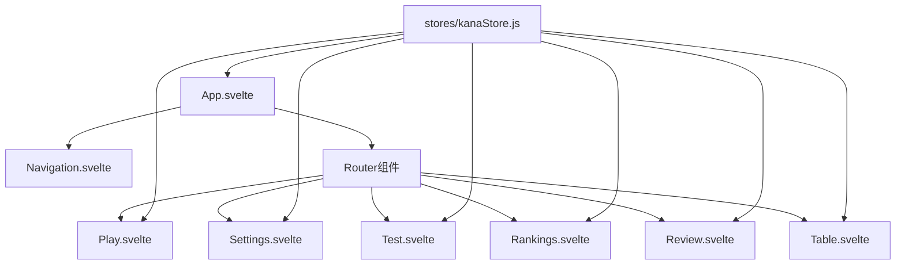

# 50音图学习工具组件拓扑图

## 组件引用关系

## 路由配置

| 路径 | 组件 | 功能描述 |
|------|------|---------|
| / | Play.svelte | 默认路由，假名播放页面 |
| /settings | Settings.svelte | 设置页面 |
| /play | Play.svelte | 假名播放页面 |
| /test | Test.svelte | 假名测试页面 |
| /ranking | Rankings.svelte | 排名页面 |
| /review | Review.svelte | 错题复习页面 |
| /table | Table.svelte | 50音图总览页面 |

## 组件功能说明

### App.svelte
- 应用程序的根组件
- 导入并配置所有页面组件
- 设置路由系统
- 检查用户设置，决定初始导航页面

### Navigation.svelte
- 导航栏组件
- 提供页面间的导航功能
- 显示当前活动页面

### 页面组件

#### Table.svelte
- 以表格形式展示50音图
- 支持切换平假名/片假名
- 支持切换清音/浊音/拗音
- 支持点击播放假名发音
- 支持连续播放行/列假名

#### Play.svelte
- 按设置顺序播放假名
- 提供播放控制功能
- 显示假名和罗马音
- 显示播放进度和设置信息

#### Test.svelte
- 提供假名听力测试功能
- 记录测试结果
- 将错误的假名添加到错题库

#### Rankings.svelte
- 显示用户的测试记录
- 支持按不同条件排序
- 支持删除测试记录

#### Review.svelte
- 显示用户的错题列表
- 提供错题复习功能
- 记录连续答对次数

#### Settings.svelte
- 提供各种设置选项
- 保存用户设置到Chrome存储

### 数据存储

#### kanaStore.js
- 存储平假名和片假名数据
- 管理用户设置
- 管理错题库
- 管理测试记录
- 提供工具函数
